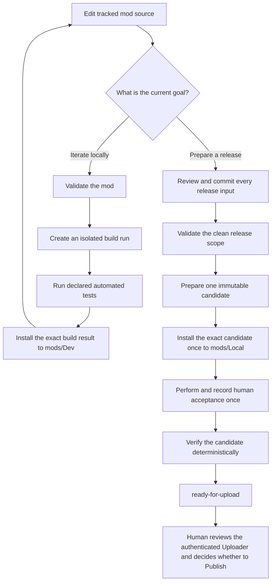

# ONI mod development workflow

ONI Mod Pipeline is the repository's supported workflow for developing an Oxygen Not Included mod, producing exact test and build artifacts, preparing an immutable release candidate, recording human acceptance, and proving that the candidate is ready for a deliberate manual ONI Uploader handoff. The user-facing command is `oni-mod-pipeline`.

> [!IMPORTANT]
> ONI Mod Pipeline stops at `ready-for-upload`. It does not change Workshop subscriptions or enabled-mod state, open or populate the ONI Uploader, use Steam credentials, or select **Publish**.

## Choose the documentation for your task

| Task | Documentation | Outcome |
| --- | --- | --- |
| Configure a checkout and verify discovery | [Getting started with ONI Mod Pipeline](getting-started-with-oni-mod-pipeline.md) | The correct SDK, profile, game installation, user-data directory, and artifact root resolve successfully. |
| Build, test, and install changes repeatedly | [Developing ONI mods](developing-oni-mods.md) | A specific isolated development build is tested and installed to a guarded `mods/Dev` destination. |
| Turn reviewed source into a Workshop-ready candidate | [Preparing ONI mod releases](preparing-oni-mod-releases.md) | One immutable candidate progresses from `awaiting-acceptance` to `ready-for-upload`. |
| Author or review `oni-mod-pipeline.toml` | [ONI Mod Pipeline profile reference](oni-mod-pipeline-profile-reference.md) | The mod's build, package, listing, installation, automated-test, and acceptance contract is explicit and valid. |
| Respond to a diagnostic or failed run | [Troubleshooting ONI Mod Pipeline](troubleshooting-oni-mod-pipeline.md) | The exact failing input or artifact is diagnosed without mutating or substituting evidence. |

## Understand the two artifact lifecycles

Development runs and release candidates solve different problems. A development build is disposable and repeatable: edit source, create a new isolated build, test it, and install that exact build result. A release candidate is an immutable claim about committed source: prepare it once, install it once, record acceptance once, and verify it deterministically.



The loop back to source belongs only to development runs. If a prepared candidate is wrong, failed, or invalidated, preserve it as evidence, correct the tracked source or workflow, commit the correction, and prepare a new candidate with a new run ID.

## Choose a command by responsibility

| Command | Run it when | Files or state it can change | Exact result to retain |
| --- | --- | --- | --- |
| `diagnose` | Setting up a checkout or investigating environment discovery | Nothing; it is read-only | Resolved profile, SDK, game, managed-assembly, user-data, and artifact paths |
| `validate` | After changing profile, metadata, package declarations, tests, or Workshop inputs | Nothing; it is read-only | Diagnostics for the declared mod and resolved environment |
| `build` | A new DLL or content build is needed for local iteration | One new isolated build run beneath the artifact root | The printed `build-result.json` path |
| `test` | Behavior or declared test inputs changed, and before release work | One new automated-test evidence directory | The printed results directory containing required TRX files |
| `install --mod … --build-result …` | Installing one known development build | One ownership-guarded Dev or Local installation | The printed installation destination |
| `prepare-release` | Every contributing release input is reviewed, committed, and clean | One new immutable candidate directory | The printed candidate directory, content digest, and `awaiting-acceptance` state |
| `install --candidate …` | Beginning acceptance of one exact candidate | One ownership-guarded installation plus one candidate receipt | The printed installation destination and receipt result |
| `record-acceptance` | A human tester has completed every immutable acceptance check | One create-new acceptance result | The printed `acceptance-test-results.json` path |
| `verify-release` | Acceptance evidence exists and immediately before Uploader handoff | Only the candidate's derived summary, checklist, and readiness report | Candidate state and exact Uploader paths |

Use `--format json` when an automated caller needs structured output from a command that supports it. Human-readable output is the default. `record-acceptance` is deliberately interactive and has no JSON input mode.

## Carry exact paths between commands

ONI Mod Pipeline never selects an artifact by timestamp, directory order, or a “latest” convention. Successful commands print the path that identifies their result:

- `build` prints one exact `build-result.json`;
- `test` prints one exact automated-test-results directory;
- `prepare-release` prints one exact candidate directory and content digest;
- `install` prints one exact managed destination and whether a candidate receipt was written;
- `record-acceptance` prints one exact acceptance-results file; and
- `verify-release` writes the summary and Uploader checklist beneath that exact candidate.

Copy the printed path into the next command. Do not replace it with a similarly named directory, a mutable Dev/Local install, or another run that appears newer.

## Keep source, content, and evidence distinct

The workflow uses three kinds of objects with different semantics:

| Object | Purpose | May be edited? |
| --- | --- | --- |
| Tracked mod source | Authoritative code, metadata, profile, tests, listing text, preview, and dependency declarations | Yes, through normal reviewed source changes before candidate preparation |
| Candidate content | Exact runtime package and Workshop listing bytes identified by one canonical content digest | No; prepare a new candidate after any source correction |
| Release evidence | Provenance, manifests, test results, installation receipt, human acceptance, readiness report, summary, and checklist | Only through the lifecycle command that owns each evidence file |

The candidate keeps these object types in separate directories:

```text
<candidate>/
  workshop-content/   # Runtime files selected by the package allowlist
  workshop-listing/   # Generated description, change notes, and preview
  release-evidence/   # Provenance, tests, acceptance, and readiness documents
```

Only `workshop-content` is suitable for the ONI Uploader's **Update Data** field. Listing fields come from `workshop-listing`. `release-evidence` is never Workshop content.

## Respect ownership and human boundaries

- Installation replaces a destination only when `.oni-mod-pipeline-owner.json` identifies the same static ID and managed directory. An unowned directory is preserved and rejected.
- A duplicate subscribed copy produces diagnostic `ONIP2005`. The pipeline reports it but does not disable, unsubscribe, edit, or delete it.
- `mod_info.yaml` remains the version source of truth. The pipeline validates and records the version but never increments or rewrites it.
- Tracked Workshop description and change-note files remain the reviewed source of truth. Candidate preparation renders separate Windows-Uploader-compatible files without rewriting the source.
- Human acceptance is an attestation about the exact installed candidate bytes. It is not inferred from automated tests.
- `ready-for-upload` means the candidate passed pipeline verification. It does not mean the authenticated form was reviewed or that publication occurred.

## Continue with the appropriate procedure

- New checkout: [Getting started with ONI Mod Pipeline](getting-started-with-oni-mod-pipeline.md)
- Normal edit/build/test/install work: [Developing ONI mods](developing-oni-mods.md)
- Versioned Workshop release: [Preparing ONI mod releases](preparing-oni-mod-releases.md)
- Profile semantics: [ONI Mod Pipeline profile reference](oni-mod-pipeline-profile-reference.md)
- Diagnostics and recovery: [Troubleshooting ONI Mod Pipeline](troubleshooting-oni-mod-pipeline.md)
